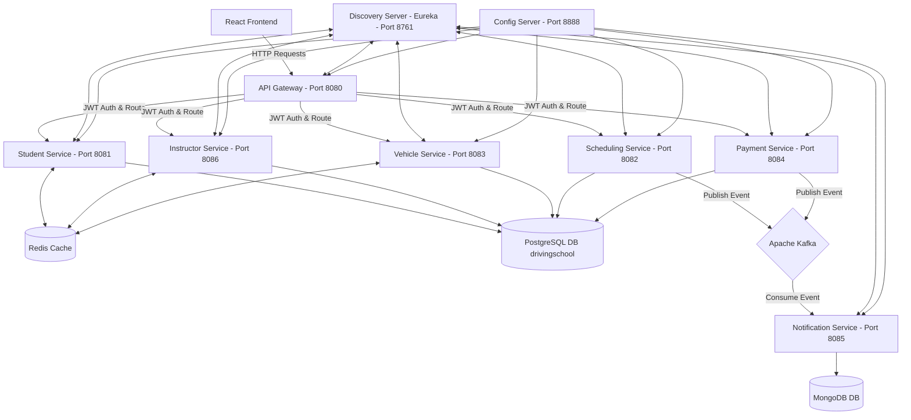
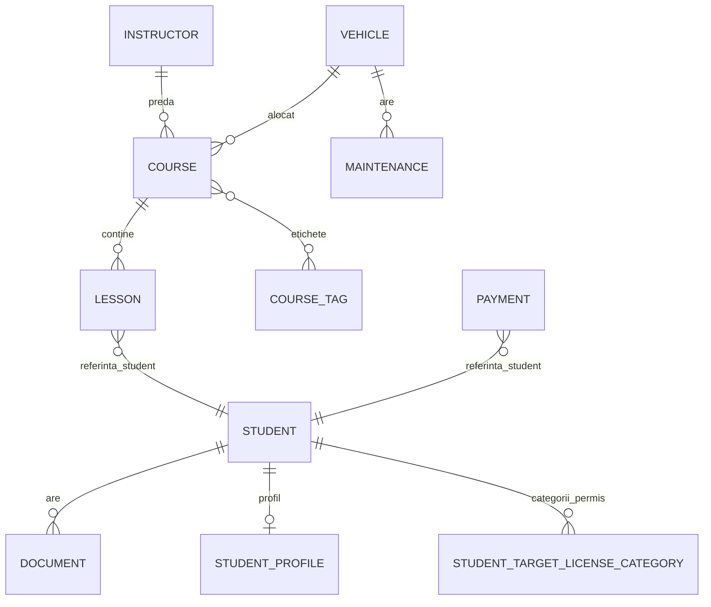

# Driving School Management System

### Aplicația rulează în producție pe Azure:
# **[http://4.166.164.189/](http://4.166.164.189/)**

---

## Despre Proiect

O platformă pe microservicii pentru gestionarea operațiunilor unei școli de șoferi. Sistemul acoperă procesele administrative principale: înscrierea și dosarul elevului, flota auto și reviziile tehnice, instructorii și cursurile, programarea ședințelor practice și tranzacțiile financiare cu calculul soldului per elev.

---

## Arhitectura Sistemului

Microserviciile sunt independente și comunică fie asincron prin evenimente Kafka, fie sincron prin HTTP, securizate la nivel de rețea.

### Diagrama Arhitecturală



### Modulele și Porturile Serviciilor

| Serviciu | Port local | Rol |
| :--- | :--- | :--- |
| **API Gateway** | 8080 | Punct unic de intrare, rutare, securitate JWT. |
| **Student Service** | 8081 | Gestiune elevi, profile, documente, validări CNP și contact. |
| **Scheduling Service** | 8082 | Programarea ședințelor, verificarea disponibilității resurselor. |
| **Vehicle Service** | 8083 | Gestiunea flotei auto și fișelor de mentenanță. |
| **Payment Service** | 8084 | Tranzacții financiare, solduri, restanțe. |
| **Notification Service** | 8085 | Consumă mesaje Kafka, salvează notificări în MongoDB. |
| **Instructor Service** | 8086 | Gestionarea instructorilor și cursurilor. |
| **Discovery Server** | 8761 | Eureka Server pentru service discovery și load balancing intern. |
| **Config Server** | 8888 | Configurare centralizată din fișiere locale. |

### Stack Tehnologic

- **Backend:** Java 21, Spring Boot 4.1.0, Spring Cloud 2025.1.2
- **Securitate:** Spring Security + JWT stateless. Parole hash-uite cu BCrypt.
- **Baze de date relaționale:** PostgreSQL 17 (toate serviciile de business)
- **NoSQL:** MongoDB (`notification-service`)
- **Caching:** Redis
- **Event broker:** Apache Kafka (KRaft mode)
- **Frontend:** React 18, TypeScript, Vite. CSS vanilla cu Light/Dark Mode și autorizare pe bază de roluri.
- **Testare:** JUnit 5, Mockito, acoperire minimă 70% impusă prin JaCoCo la build.

---

## Setup

### Cerințe

- Java 21 JDK+
- Node.js v18+ și npm
- Maven 3.8+
- Docker & Docker Compose

### 1. Compilare backend

```bash
mvn clean install
```

*Testele rulează pe H2 in-memory (profilul `local-h2`) — nu e nevoie de o bază de date externă.*

### 2. Pornire infrastructură

```bash
docker compose up -d
```

Porturi expuse:

- PostgreSQL: 5432
- Redis: 6379
- Kafka: 29092
- MongoDB: 27017

### 3. Profile de rulare

- `local-h2` (implicit): H2 in-memory, fără dependințe externe.
- `local-docker`: se conectează la PostgreSQL din Docker.

Exemplu cu profil explicit:

```bash
cd student-service
mvn spring-boot:run -Dspring-boot.run.profiles=local-docker
```

### 4. Ordinea de pornire

1. `discovery-server`
2. `config-server`
3. Serviciile de business (`student-service`, `instructor-service`, `vehicle-service`, `payment-service`, `scheduling-service`, `notification-service`)
4. `api-gateway`

### 5. Frontend

```bash
cd frontend
npm install

# backend local-h2
npm run dev:local-h2

# backend local-docker
npm run dev:local-docker
```

Aplicația rulează la [http://localhost:5173](http://localhost:5173).

### 6. Conturi de test

| Utilizator | Parolă | Rol | Permisiuni |
| :--- | :--- | :--- | :--- |
| **`admin`** | `password` | `ROLE_ADMIN` | Management complet, mentenanță auto, editare roluri. |
| **`instructor`** | `password` | `ROLE_INSTRUCTOR` | Elevi arondați, orar propriu. |
| **`student`** | `password` | `ROLE_STUDENT` | Catalog cursuri, programări, istoric tranzacții. |

---

## API Documentation

Fiecare serviciu expune Swagger/OpenAPI v3.

| Serviciu | Swagger UI | OpenAPI Docs |
| :--- | :--- | :--- |
| **API Gateway** (Combined) | [http://localhost:8080/swagger-ui.html](http://localhost:8080/swagger-ui.html) | `/v3/api-docs` |
| **Student Service** | [http://localhost:8081/swagger-ui.html](http://localhost:8081/swagger-ui.html) | `/v3/api-docs` |
| **Scheduling Service** | [http://localhost:8082/swagger-ui.html](http://localhost:8082/swagger-ui.html) | `/v3/api-docs` |
| **Vehicle Service** | [http://localhost:8083/swagger-ui.html](http://localhost:8083/swagger-ui.html) | `/v3/api-docs` |
| **Payment Service** | [http://localhost:8084/swagger-ui.html](http://localhost:8084/swagger-ui.html) | `/v3/api-docs` |
| **Notification Service** | [http://localhost:8085/swagger-ui.html](http://localhost:8085/swagger-ui.html) | `/v3/api-docs` |
| **Instructor Service** | [http://localhost:8086/swagger-ui.html](http://localhost:8086/swagger-ui.html) | `/v3/api-docs` |

### Scripturi utilitare (`/scripts`)

- `generate-combined-openapi.ps1` — pornește toate serviciile și agregă specificațiile OpenAPI într-un singur JSON.
- `update-postman-from-openapi.ps1` — sincronizează colecția Postman cu rutele din OpenAPI, pe baza cheii API Postman.

---

## Baza de Date

Fiecare serviciu își gestionează propria schemă. Local, toate partajează aceeași bază de date PostgreSQL (`drivingschool`), dar Flyway folosește prefixe separate per serviciu (`flyway_schema_history_<service_name>`) pentru a evita coliziunile de versiuni.

### Diagrama conceptuală



### Diagrama detaliată


