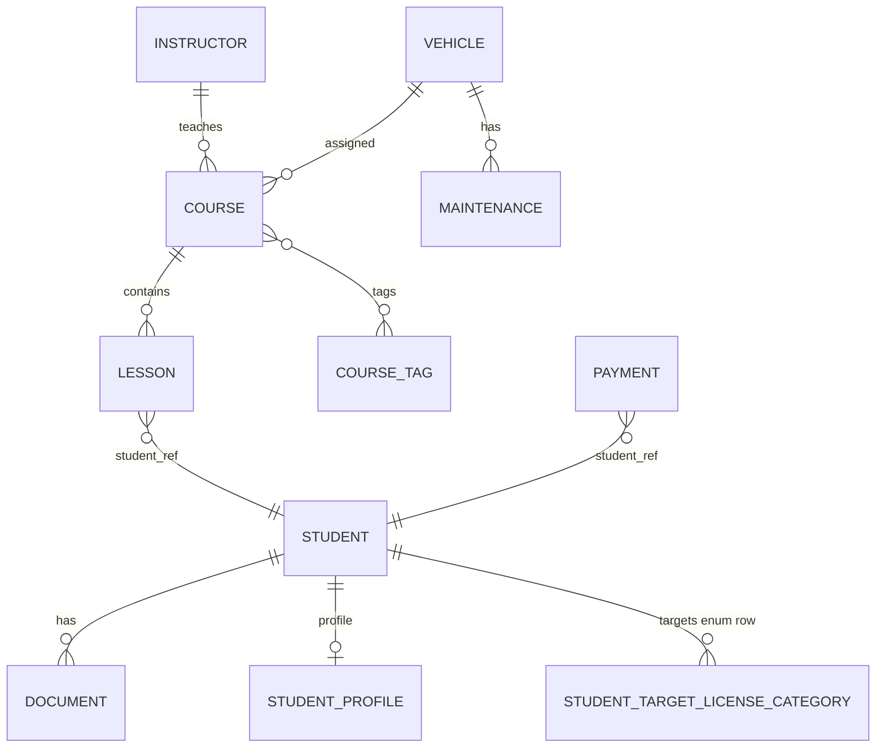

# Driving School Management System

This project represents a distributed platform for managing a driving school's operations, implemented on a microservices architecture. The solution uses Spring Boot 4.0.1, API Gateway, Apache Kafka for asynchronous communication, Redis for caching, and supports multiple persistence.

## Overview

The system centralizes the school's operational processes, offering functionalities for:

- **Student Management:** Registration, data validation (CNP, contact) and management of student files.
- **Scheduling:** Lesson booking system with real-time availability verification.
- **Instructor Management:** Management of instructors and their specializations.
- **Vehicle Management:** Vehicle records and technical status (maintenance).
- **Courses:** Structuring of theoretical and practical modules.
- **Payment Processing:** Processing payments and calculating balances per student.
- **Notifications:** Distribution of system events through Kafka.

## Architecture

The system is composed of the following microservices:

- **API Gateway** (port 8080): Entry point for all external requests.
- **Student Service** (port 8081): Student data management.
- **Scheduling Service** (port 8082): Booking logic and calendar.
- **Vehicle Service** (port 8083): Vehicle fleet management.
- **Payment Service** (port 8084): Transactions and balances.
- **Notification Service** (port 8085): Kafka consumer for notifications.
- **Instructor Service** (port 8086): Teaching staff management.

## Technology Stack

- **Language:** Java 21
- **Framework:** Spring Boot 4.0.1, Spring Cloud 2025.1.0
- **Gateway:** Spring Cloud Gateway
- **Messaging:** Apache Kafka
- **Caching:** Redis
- **Database:** PostgreSQL 17
- **Documentation:** SpringDoc OpenAPI (Swagger)
- **Testing:** JUnit 5, Mockito
- **Build:** Maven

## System Requirements

The following are required to run the project:

- Java 21 JDK
- Maven 3.8+
- Docker & Docker Compose
- PostgreSQL 17+
- Redis 7+
- Apache Kafka 3.5+

## Installation and Configuration

### 1. Infrastructure Initialization

Start the dependent services (Database, Broker, Cache) using Docker Compose:

```bash
docker-compose up -d
```

This will expose:
- PostgreSQL: port 5432
- Redis: port 6379
- Kafka & Zookeeper: ports 9092, 2181

Check container status:

```bash
docker-compose ps
```

### 2. Build Project

Compile modules, run tests and create JAR archives:

```bash
mvn clean install
```

### 3. Database configuration and Flyway migrations

PostgreSQL must be running before starting any JPA-based service (`docker-compose up -d`).

**Schema changes** are managed with [Flyway](https://flywaydb.org/): each service that uses JPA includes SQL scripts under `src/main/resources/db/migration/`. On startup, Flyway applies pending migrations, then Hibernate runs with `ddl-auto: validate` (the schema must match the entities—no auto `update`).

**Shared database:** all services use the same Postgres database (`drivingschool`) but **each service has its own Flyway history table** (e.g. `flyway_schema_history_student_service`) so migration versions do not collide. They still share schema `public`, so the **first** service to start sees an empty schema; the **next** ones see tables from siblings but not their own history table. Without extra config, Flyway stops with *“non-empty schema … but no schema history table”*. Each service therefore sets **`spring.flyway.baseline-on-migrate: true`** and **`spring.flyway.baseline-version: 0`**: Flyway creates that service’s history table on a non-empty DB and still applies **`V1`** and later scripts (because `1 > 0`).

**Workflow for a schema change**

1. Edit the JPA entity (or add a new one).
2. Add a new script `V{next}__short_description.sql` in that service’s `db/migration` folder (never edit an already-applied migration in shared environments).
3. Start the service (or run Flyway against the DB) to apply it.
4. Confirm the app starts cleanly with `ddl-auto: validate`.

**Existing databases** from Hibernate-only `ddl-auto: update` may not match the Flyway scripts. Prefer a clean DB for local dev, or align schema + history manually (`repair` / targeted baseline). The `baseline-on-migrate` settings above fix **order-of-startup** across microservices, not mismatches between old DDL and new SQL.

### 4. Starting Services

Services must be started in the following order to avoid dependency errors at startup:

1. Student Service
2. Instructor Service
3. Vehicle Service
4. Payment Service
5. Scheduling Service
6. Notification Service
7. API Gateway

They can be run manually from the terminal (e.g., `cd student-service && mvn spring-boot:run`) or directly from the IDE by running the corresponding `*Application.java` class for each module.

### 4.1 Runtime profiles (`local-h2` and `local-docker`)

The project uses two local runtime profiles:

- `local-h2` (default): in-memory H2 for JPA services, fastest startup, no PostgreSQL required.
- `local-docker`: PostgreSQL from Docker (`jdbc:postgresql://localhost:5432/drivingschool`), closest to production behavior.

Examples:

```bash
# run one service with H2 (also the default profile)
cd student-service
mvn spring-boot:run -Dspring-boot.run.profiles=local-h2

# run one service with PostgreSQL from docker-compose
cd student-service
mvn spring-boot:run -Dspring-boot.run.profiles=local-docker
```

For multi-service local runs, keep the same profile across all services in that session.
When using `local-docker`, start infrastructure first (`docker-compose up -d`).

### 5. Status Verification

After startup, services can be verified at the following addresses:

| Service              | Base URL              | Swagger UI                            | OpenAPI Docs                      |
|----------------------|-----------------------|---------------------------------------|-----------------------------------|
| API Gateway          | http://localhost:8080 | http://localhost:8080/swagger-ui.html | http://localhost:8080/v3/api-docs |
| Student Service      | http://localhost:8081 | http://localhost:8081/swagger-ui.html | http://localhost:8081/v3/api-docs |
| Scheduling Service   | http://localhost:8082 | http://localhost:8082/swagger-ui.html | http://localhost:8082/v3/api-docs |
| Vehicle Service      | http://localhost:8083 | http://localhost:8083/swagger-ui.html | http://localhost:8083/v3/api-docs |
| Payment Service      | http://localhost:8084 | http://localhost:8084/swagger-ui.html | http://localhost:8084/v3/api-docs |
| Notification Service | http://localhost:8085 | http://localhost:8085/swagger-ui.html | http://localhost:8085/v3/api-docs |
| Instructor Service   | http://localhost:8086 | http://localhost:8086/swagger-ui.html | http://localhost:8086/v3/api-docs |

## API Documentation

APIs are documented through Swagger/OpenAPI 3.0. The main access point is the Swagger exposed by the API Gateway: http://localhost:8080/swagger-ui.html.

### Combined OpenAPI Generation

To generate a single JSON file containing definitions for all services:

1. Ensure all services are running.
2. Run the aggregation script:
   ```powershell
   cd scripts
   .\generate-combined-openapi.ps1
   ```
3. The file `DrivingSchoolManagementSystem-API-1.0.0.swagger_collection.json` will be generated in the project root.

## Testing

Running all unit tests:

```bash
mvn test
```

Tests are forced to run with profile `local-h2` through Maven Surefire (`spring.profiles.active=local-h2`) to avoid accidental dependency on local Docker PostgreSQL.

Run full quality checks (tests + JaCoCo threshold) with:

```bash
mvn verify
```

JaCoCo enforces a minimum **70% line coverage** for classes under `...service...` packages during `verify`. If coverage drops below threshold, the build (including CI) fails.

Running tests for a single module:

```bash
cd student-service
mvn test
```

Coverage reports (JaCoCo) are generated per module in `target/site/jacoco/index.html` (for example: `student-service/target/site/jacoco/index.html`).

## Project Structure

```
driving-school-platform/
├── api-gateway/          # API Gateway service
├── student-service/      # Student management
├── scheduling-service/   # Lesson scheduling
├── vehicle-service/      # Vehicle management
├── payment-service/      # Payment processing
├── instructor-service/   # Instructor management
├── notification-service/ # Event notifications
├── common/               # Shared code (exceptions, DTOs, validations)
├── docker-compose.yml    # Infrastructure configuration
├── REQUIREMENTS.md       # Functional specifications
└── README.md             # Technical documentation
```

## MVP Features

The current version implements the following basic features:

- **Student Management:** CNP/contact data validation and document storage.
- **Lesson Scheduling:** Booking with resource availability verification.
- **Instructors & Courses:** Course type definition and instructor associations.
- **Vehicles:** Fleet records and maintenance status.
- **Financial:** Payment processing and current balance calculation.

## Database Schema

The main entities of the system are:

- **Student:** Personal data of the student.
- **StudentProfile:** One-to-one extended data (emergency contact, notes) for a student.
- **DrivingLicenseCategory (enum):** Fixed licence classes (B, C, …); stored per student in collection table `student_target_license_categories` (not a separate entity table).
- **Document:** Files associated with students.
- **Instructor:** Personal and professional data of instructors.
- **Vehicle:** Technical data of vehicles.
- **Maintenance:** Vehicle service operations.
- **Course:** Available course types.
- **CourseTag:** Labels such as intensive/weekend offerings; many-to-many with courses.
- **Lesson:** Actual lessons (scheduled/completed).
- **Payment:** Financial transactions.

Each microservice owns its schema in PostgreSQL (logically separate databases or schemas). The diagram below is a **conceptual ER view** across services (foreign keys such as `student_id` on lessons are stored as IDs, not JPA relations to `Student`).

### Entity-relationship diagram



## Postman Collection

For manual testing, import the file `DrivingSchoolManagementSystem-API-1.0.0.postman_collection.json`. It contains pre-configured requests for all endpoints.

### Automatic Postman Update

If changes have been made to the API, the Postman collection can be automatically updated based on OpenAPI:

1. Start the services.
2. Set the environment variables `POSTMAN_API_KEY` and `POSTMAN_COLLECTION_UID`.
3. Run the script:
   ```powershell
   .\scripts\update-postman-from-openapi.ps1
   ```

## Configuration

Service configuration is done through the `application.yml` files in each module. Main parameters include:

- Runtime profile selection (`local-h2`, `local-docker`).
- Database connection string (H2 for `local-h2`, PostgreSQL for `local-docker` in JPA services).
- Host/Port for Redis and Kafka.
- Specific ports for each service.
- Routes defined in the API Gateway.

## Logging (Epic G)

Each runnable service now has a `logback-spring.xml` in `src/main/resources` using SLF4J + Logback with profile-aware verbosity:

- `local-h2`: `com.drivingschool` logs at `DEBUG` (useful for local troubleshooting).
- `local-docker`: `com.drivingschool` logs at `INFO` (cleaner runtime logs).

Output is written both to console and files under:

- `logs/<spring.application.name>/application.log` (all levels configured on root logger)
- `logs/<spring.application.name>/error.log` (only `ERROR`, dedicated appender)

`logs/` is already ignored by Git via `.gitignore`.

To change verbosity quickly, edit the `<logger name="com.drivingschool" .../>` levels in each service's `logback-spring.xml`.

## Pagination and sorting (Epic F)

The following list endpoints now support Spring-style pagination parameters: `page`, `size`, `sortBy`, `sortDir`:

- `GET /api/students`
- `GET /api/vehicles`
- `GET /api/courses`

Examples:

```bash
# page 0, 10 items, newest students first
GET /api/students?page=0&size=10&sortBy=registrationDate&sortDir=desc

# vehicles sorted by make ascending
GET /api/vehicles?page=0&size=20&sortBy=make&sortDir=asc

# courses filtered by instructor, sorted by price
GET /api/courses?instructorId=1&page=0&size=15&sortBy=price&sortDir=asc
```

Default page size is configurable per service with:

```yaml
app:
  pagination:
    default-page-size: 20
```

## Spring Security (Epic H)

Authentication is implemented in `api-gateway` using **JDBC + JWT**:

- Users and roles are stored in gateway DB tables: `auth_users`, `auth_roles`, `auth_user_roles`.
- Passwords are hashed with **BCrypt**.
- Login endpoint: `POST /auth/login` (returns bearer token).
- Logout endpoint: `POST /auth/logout` (stateless JWT logout contract; client removes token).

Seed users (migration `api-gateway/src/main/resources/db/migration/V1__create_auth_tables.sql`):

- `student` / `password` -> `ROLE_STUDENT`
- `instructor` / `password` -> `ROLE_INSTRUCTOR`
- `admin` / `password` -> `ROLE_ADMIN`

JWT-protected route policy (gateway):

- Public: `/auth/**`, `/swagger-ui/**`, `/v3/api-docs/**`, `/actuator/health`
- `DELETE /api/**` -> `ROLE_ADMIN`
- `/api/instructors/**` -> `ROLE_INSTRUCTOR` or `ROLE_ADMIN`
- `/api/students/**` -> `ROLE_STUDENT` or `ROLE_ADMIN`
- Other `/api/**` -> authenticated user

For JWT stateless APIs, CSRF is disabled by design (no server-side session).

