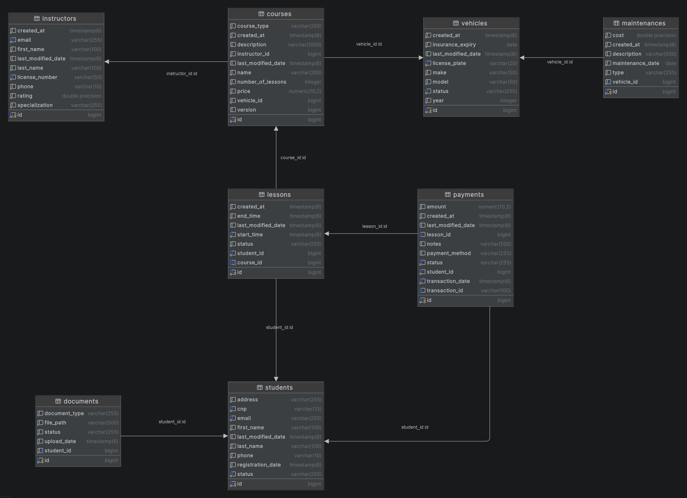

# Cerințe de Business - Sistem de Management Școală Auto

## 1. Cerințe de Business

### BR1: Management Studenți
Sistemul permite înregistrarea, actualizarea și ștergerea studenților. Fiecare student are CNP unic, email unic, telefon valid (10 cifre) și adresă. Status disponibil: PENDING, ACTIVE, SUSPENDED, GRADUATED.

### BR2: Management Documente Studenți
Sistemul permite încărcarea și gestionarea documentelor pentru fiecare student. Tipuri acceptate: copie CI, certificat medical, fotografie, copie permis. Status document: PENDING, APPROVED, REJECTED.

### BR3: Management Instructori
Sistemul permite înregistrarea și gestionarea instructorilor cu număr de licență unic, email unic, telefon valid și specializare (THEORETICAL, PRACTICAL, BOTH). Include căutare după specializare și verificare disponibilitate.

### BR4: Management Vehicule
Sistemul permite înregistrarea și gestionarea flotei de vehicule cu număr de înmatriculare unic, marcă, model, an, dată expirare asigurare și status (AVAILABLE, IN_USE, MAINTENANCE, OUT_OF_SERVICE). Include trimitere în mentenanță și returnare în serviciu.

### BR5: Management Mentenanță Vehicule
Sistemul permite înregistrarea și urmărirea operațiunilor de mentenanță pentru fiecare vehicul. Fiecare operațiune conține dată, tip (ROUTINE, REPAIR, INSPECTION, OTHER), descriere și cost.

### BR6: Management Cursuri
Sistemul permite crearea și gestionarea cursurilor cu nume, descriere, preț, instructor asociat, vehicul asociat, număr de lecții și tip (THEORETICAL, PRACTICAL). Ștergerea este permisă doar dacă nu există lecții asociate.

### BR7: Programare Lecții
Sistemul permite rezervarea, actualizarea și anularea lecțiilor cu verificare automată a disponibilității instructorului și vehiculului. Status lecție: SCHEDULED, COMPLETED, CANCELLED, NO_SHOW.

### BR8: Verificare Disponibilitate
Sistemul verifică disponibilitatea instructorilor și vehiculelor pentru un interval de timp specificat, luând în considerare toate lecțiile programate pentru a preveni suprapunerea.

### BR9: Management Plăți
Sistemul procesează plăți pentru lecții și cursuri. Fiecare plată conține student, sumă, metodă (CARD, CASH, BANK_TRANSFER, ONLINE), status (PENDING, COMPLETED, FAILED, REFUNDED, CANCELLED), dată tranzacție și ID tranzacție unic. Include calculare balanță și procesare rambursări.

### BR10: Notificări Evenimente
Sistemul trimite notificări automatizate pentru evenimente importante: rezervare lecție, anulare lecție, confirmare plată, trimitere vehicul în mentenanță. Notificările sunt gestionate prin mesagerie asincronă.

## 2. Funcționalități MVP

### Funcționalitate 1: Management Studenți și Documente
Permite înregistrarea completă a studenților cu validare CNP, email și telefon, plus încărcare și gestionare documente cu tracking status aprobare.

**Endpoints:**
- POST `/api/students` - Înregistrare student
- GET `/api/students/{id}` - Detalii student
- PUT `/api/students/{id}` - Actualizare student
- DELETE `/api/students/{id}` - Ștergere student
- POST `/api/students/{id}/documents` - Încărcare document
- GET `/api/students/{id}/documents` - Listare documente

**Validări:**
- CNP unic și valid
- Email unic
- Telefon 10 cifre
- Status documente: PENDING → APPROVED/REJECTED

### Funcționalitate 2: Programare și Management Lecții
Permite rezervarea lecțiilor cu verificare automată disponibilitate instructor și vehicul. Previne suprapunerea programărilor și permite reschedulare sau anulare.

**Endpoints:**
- POST `/api/lessons` - Rezervare lecție
- GET `/api/lessons/{id}` - Detalii lecție
- PUT `/api/lessons/{id}` - Reschedulare lecție
- DELETE `/api/lessons/{id}` - Anulare lecție
- GET `/api/lessons/instructors/{instructorId}/availability` - Verificare disponibilitate instructor
- GET `/api/lessons/vehicles/{vehicleId}/availability` - Verificare disponibilitate vehicul
- GET `/api/lessons/students/{studentId}` - Listare lecții student

**Validări:**
- Verificare conflict programări
- Validare interval timp (startTime < endTime)
- Prevenire rezervări în trecut

### Funcționalitate 3: Management Cursuri și Instructori
Permite crearea și gestionarea cursurilor cu instructor și vehicul asociat, plus căutare instructori după specializare și verificare disponibilitate.

**Endpoints:**
- POST `/api/courses` - Creare curs
- GET `/api/courses/{id}` - Detalii curs
- PUT `/api/courses/{id}` - Actualizare curs
- DELETE `/api/courses/{id}` - Ștergere curs
- POST `/api/instructors` - Înregistrare instructor
- GET `/api/instructors/{id}` - Detalii instructor
- GET `/api/instructors/available` - Listare instructori disponibili
- GET `/api/instructors/specialization/{specialization}` - Căutare după specializare

**Validări:**
- Număr licență instructor unic
- Email instructor unic
- Specializare: THEORETICAL, PRACTICAL, BOTH
- Tip curs: THEORETICAL, PRACTICAL
- Preț și număr lecții pozitive

### Funcționalitate 4: Management Vehicule și Mentenanță
Permite gestionarea flotei de vehicule, inclusiv trimitere în mentenanță și returnare în serviciu. Înregistrează toate operațiunile de mentenanță cu costuri și tipuri.

**Endpoints:**
- POST `/api/vehicles` - Înregistrare vehicul
- GET `/api/vehicles/{id}` - Detalii vehicul
- PUT `/api/vehicles/{id}` - Actualizare vehicul
- GET `/api/vehicles/available` - Listare vehicule disponibile
- PUT `/api/vehicles/{id}/maintenance` - Trimite în mentenanță
- PUT `/api/vehicles/{id}/maintenance/return` - Returnare din mentenanță

**Validări:**
- Număr înmatriculare unic
- Dată expirare asigurare viitoare
- Status: AVAILABLE, IN_USE, MAINTENANCE, OUT_OF_SERVICE
- Tip mentenanță: ROUTINE, REPAIR, INSPECTION, OTHER
- Prevenire utilizare vehicul în mentenanță

### Funcționalitate 5: Procesare Plăți și Balanțe
Permite procesarea plăților pentru lecții și cursuri cu suport pentru multiple metode de plată. Calculează balanțele studenților și permite rambursări.

**Endpoints:**
- PUT `/api/payments` - Procesare plată
- POST `/api/payments/pending` - Creare plată pending
- GET `/api/payments/{id}` - Detalii plată
- GET `/api/payments/student/{studentId}` - Listare plăți student
- GET `/api/payments/student/{studentId}/balance` - Calculare balanță student
- PUT `/api/payments/{id}/refund` - Procesare rambursare
- PUT `/api/payments/{id}/status` - Actualizare status plată

**Validări:**
- Sumă pozitivă
- Metodă: CARD, CASH, BANK_TRANSFER, ONLINE
- Status: PENDING → COMPLETED/FAILED → REFUNDED
- ID tranzacție unic
- Calcul balanță = sumă totală plăți COMPLETED
- Prevenire rambursare dublă (pessimistic locking)

## 3. Diagrama Relațiilor dintre Entități (Schema Bazei de Date)

Diagrama Entity-Relationship (ERD) a sistemului reflectă structura reală a bazei de date PostgreSQL.

### 4. Note Tehnice

- **Audit Fields**: Toate entitățile conțin câmpuri de audit (`created_at`, `last_modified_date`) pentru tracking automat
- **Optimistic Locking**: Entitatea `courses` folosește `version` pentru prevenirea concurenței
- **Cascade Operations**: Relațiile JPA sunt configurate cu cascade operations unde este necesar (ex: Student → Documents)
- **Nullable Foreign Keys**: 
  - `lessons.course_id` este nullable pentru a permite lecții standalone
  - `payments.lesson_id` este nullable pentru plăți generale (nu asociate unei lecții specifice)
- **Validări la Nivel de Câmp**: Toate entitățile au validări implementate prin Bean Validation (@NotNull, @NotBlank, @Email, @Pattern, etc.)
- **Arhitectură Microservices**: Unele relații sunt logice (prin ID-uri) între servicii diferite, nu relații JPA directe